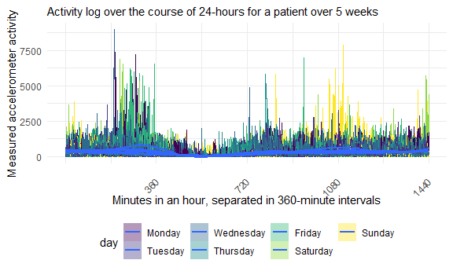
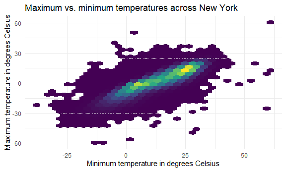

p8105\_hw3\_mgg2153
================
mggn
10/7/2020

## Problem 1, as discussed in class

``` r
data("instacart")
```

This dataset contains 1384617 rows and 15 columns.

Observations are the level of items in orders by user. There are user /
order variables – user ID, order ID, order day, and order hour. There
are also item variables – name, aisle, department, and some numeric
codes.

How many aisles, and which are most items from?

``` r
instacart %>% 
    count(aisle) %>% 
    arrange(desc(n))
```

    ## # A tibble: 134 x 2
    ##    aisle                              n
    ##    <chr>                          <int>
    ##  1 fresh vegetables              150609
    ##  2 fresh fruits                  150473
    ##  3 packaged vegetables fruits     78493
    ##  4 yogurt                         55240
    ##  5 packaged cheese                41699
    ##  6 water seltzer sparkling water  36617
    ##  7 milk                           32644
    ##  8 chips pretzels                 31269
    ##  9 soy lactosefree                26240
    ## 10 bread                          23635
    ## # ... with 124 more rows

Let’s make a plot

``` r
instacart %>% 
    count(aisle) %>% 
    filter(n > 10000) %>% 
    mutate(
        aisle = factor(aisle),
        aisle = fct_reorder(aisle, n)
    ) %>% 
    ggplot(aes(x = aisle, y = n)) + 
    geom_point() + 
    theme(axis.text.x = element_text(angle = 90, vjust = 0.5, hjust = 1))
```


Let’s make a table\!\!

``` r
instacart %>% 
    filter(aisle %in% c("baking ingredients", "dog food care", "packaged vegetables fruits")) %>% 
    group_by(aisle) %>% 
    count(product_name) %>% 
    mutate(rank = min_rank(desc(n))) %>% 
    filter(rank < 4) %>% 
    arrange(aisle, rank) %>% 
    knitr::kable()
```

| aisle                      | product\_name                                 |    n | rank |
| :------------------------- | :-------------------------------------------- | ---: | ---: |
| baking ingredients         | Light Brown Sugar                             |  499 |    1 |
| baking ingredients         | Pure Baking Soda                              |  387 |    2 |
| baking ingredients         | Cane Sugar                                    |  336 |    3 |
| dog food care              | Snack Sticks Chicken & Rice Recipe Dog Treats |   30 |    1 |
| dog food care              | Organix Chicken & Brown Rice Recipe           |   28 |    2 |
| dog food care              | Small Dog Biscuits                            |   26 |    3 |
| packaged vegetables fruits | Organic Baby Spinach                          | 9784 |    1 |
| packaged vegetables fruits | Organic Raspberries                           | 5546 |    2 |
| packaged vegetables fruits | Organic Blueberries                           | 4966 |    3 |

Apples vs ice cream..

``` r
instacart %>% 
    filter(product_name %in% c("Pink Lady Apples", "Coffee Ice Cream")) %>% 
    group_by(product_name, order_dow) %>% 
    summarize(mean_hour = mean(order_hour_of_day)) %>% 
    pivot_wider(
        names_from = order_dow,
        values_from = mean_hour
    )
```

    ## `summarise()` regrouping output by 'product_name' (override with `.groups` argument)

    ## # A tibble: 2 x 8
    ## # Groups:   product_name [2]
    ##   product_name       `0`   `1`   `2`   `3`   `4`   `5`   `6`
    ##   <chr>            <dbl> <dbl> <dbl> <dbl> <dbl> <dbl> <dbl>
    ## 1 Coffee Ice Cream  13.8  14.3  15.4  15.3  15.2  12.3  13.8
    ## 2 Pink Lady Apples  13.4  11.4  11.7  14.2  11.6  12.8  11.9

### `summarise()` regrouping output by ‘product\_name’ (override with `.groups` argument)

## Problem 2

This dataset contains 5-weeks of accelerometer data for a 63 year old
male with a BMI of 25. He was admitted to the hospital with congestive
heart failure.

Here we are uploading the accelerometers data and tidying it just a bit,
including  
(1) cleaning names (2) changing variable types (3) creating a binary
weekday variable

``` r
accel_df = read_csv("./data/accel_data.csv") %>%
  janitor::clean_names() %>%
  mutate(
    day = as.factor(day),
    week = as.factor(week),
    weekday = if_else(day %in% c("Saturday", "Sunday"), "FALSE", "TRUE")
  ) %>%
  relocate(weekday) %>%
  pivot_longer(
    activity_1:activity_1440,
    names_to = "minute",
    names_prefix = "activity_",
    values_to = "acceleration_force"
  ) %>%
  mutate(
    minute = as.factor(minute),
    acceleration_force = as.numeric(acceleration_force)
  )
```

    ## Parsed with column specification:
    ## cols(
    ##   .default = col_double(),
    ##   day = col_character()
    ## )

    ## See spec(...) for full column specifications.

The new, tidier dataset, accel\_df has **50400** observations and **6**
variables. Those variables are **weekday, week, day\_id, day, minute,
acceleration\_force**

To continue with visualizing the data, we will create a variable for the
total activity for each day. We will show this table by week and day,
using the code below:

``` r
accel_df %>%
  mutate( 
    day = forcats::fct_relevel(day, c("Monday", "Tuesday", "Wednesday", "Thursday", "Friday", "Saturday", "Sunday"))
    ) %>%
  group_by(day, week) %>%
  summarize(activity_total = sum(acceleration_force)) %>%
  pivot_wider(
  names_from = day,
  values_from = activity_total
)
```

    ## `summarise()` regrouping output by 'day' (override with `.groups` argument)

    ## # A tibble: 5 x 8
    ##   week   Monday Tuesday Wednesday Thursday  Friday Saturday Sunday
    ##   <fct>   <dbl>   <dbl>     <dbl>    <dbl>   <dbl>    <dbl>  <dbl>
    ## 1 1      78828. 307094.   340115.  355924. 480543.   376254 631105
    ## 2 2     295431  423245    440962   474048  568839    607175 422018
    ## 3 3     685910  381507    468869   371230  467420    382928 467052
    ## 4 4     409450  319568    434460   340291  154049      1440 260617
    ## 5 5     389080  367824    445366   549658  620860      1440 138421

From quickly glancing at the table, there do not appear to be any
apparent trends, except that on Saturday for weeks 4 and 5, there seems
to be significantly less activity than any of the other days on any of
the other weeks.

Next, we will actually make a plot\!

``` r
#Accelerometer data allows the inspection activity over the course of the day. Make a single-panel plot that shows 
#the 24-hour activity time courses for each day and #use color to indicate day of the week. Describe in words any patterns 
#or conclusions you can make based on this graph.

accel_df %>%
  mutate(
    day = forcats::fct_relevel(day, c("Monday", "Tuesday", "Wednesday", "Thursday", "Friday", "Saturday", "Sunday")),
    minute = as.numeric(minute)
    #lubridate::as.duration() lemme try to figure this one out
    ) %>%
  ggplot(aes(x = minute, y = acceleration_force,group = day_id, fill = day))+
  geom_line(aes(color = day))+
  geom_smooth(aes(group = day))+
  scale_x_continuous(breaks = c(360, 720, 1080, 1440))+
  labs(
    x = "Minutes in an hour, separated in 360-minute intervals",
    y = "Measured accelerometer activity",
    title = "Activity log over the course of 24-hours for a patient over 5 weeks"
  )+
  theme(axis.text.x = element_text(angle = 45, vjust = 0.5, hjust = 1))
```

    ## `geom_smooth()` using method = 'gam' and formula 'y ~ s(x, bs = "cs")'


Looking at this plot, we can see that activity at the beginning of the
24-hour period is low, likely corresponding to sleeping and stirring in
the morning. As the day progresses, we see spikes corresponding to
increasing activity throughout the day, with an additional spike at the
end of the 24-hour period.

## Problem 3

By the way, this blog post was helpful in figuring out what tf tenths of
measurements meant:
<http://annahydro.blogspot.com/2016/09/making-sense-of-noaa-precipitation-data.html>

gotta give proper credit to the people that investigated before me.
Thanks google\!

Below I am importing the data, cleaning the names, and ensuring that
variables have meaningful values and make sense.

``` r
data("ny_noaa")

ny_weather_df =
ny_noaa %>%
  janitor::clean_names() %>%
  mutate(
    tmin = as.numeric(tmin),
    tmax = as.numeric(tmax),
  ) %>%
  separate(date, into = c("year", "month", "day")) %>%
  mutate(
    month = month.abb[as.factor(month)],
    year = as.factor(year),
    day = as.factor(day),
    tmin = tmin/10,
    tmax = tmax/10,
    prcp = prcp/10
  )
```

The resulting dataset has **2595176** and **9** The variables included
are **id, year, month, day, prcp, snow, snwd, tmax, tmin** What was
interesting is that the variables for precipitation, max, and min
temperatures were measured in “tenths,” meaning that 44 was actually
4.4\! Hence why the division by 10.

Let’s see what’s going on with snowfall:

``` r
ny_weather_df %>%
  count(month, year, snow)%>%
  group_by(month, year)
```

    ## # A tibble: 14,722 x 4
    ## # Groups:   month, year [360]
    ##    month year   snow     n
    ##    <chr> <fct> <int> <int>
    ##  1 Apr   1981      0  6964
    ##  2 Apr   1981      3     8
    ##  3 Apr   1981      5     8
    ##  4 Apr   1981      8     5
    ##  5 Apr   1981     10     5
    ##  6 Apr   1981     13    19
    ##  7 Apr   1981     15     1
    ##  8 Apr   1981     20     2
    ##  9 Apr   1981     23     2
    ## 10 Apr   1981     25    14
    ## # ... with 14,712 more rows

Using this sort of crude method, it appears that the most common
frequent value for snowfall in mm for nyc is 0. This actually makes
sense because how many months of the year is it actually cold enough to
snow? Not that many (although with climate change who knows).

And now I shall attempt to make a two-panel plot of average max
temperature in Jan and Jul in each station across years:

``` r
#library(wesanderson) a color palette I wanted to use but trying to figure out the
#syntax was taking too much time/brainspace. Next time!


ny_weather_df %>%
  filter(month %in% c("Jan", "Jul")) %>%
  group_by(id, year, month)%>%
  summarize(
    mean_tmax = mean(tmax, na.rm = TRUE)
  ) %>%
  ggplot(aes(x = year, y = mean_tmax, group = id, color = id))+
  geom_point(alpha = .5)+
  geom_path()+
  facet_grid(~month)+
  labs(
    title = "Average max temperature in January and July in each station across years",
    x = "Year",
    y = "Average maximum temperature",
    caption = "An attempt: Homework 3 ny_noaa edition"
  )+ theme_bw()+
  scale_color_hue (name = "id", h = c(100, 300))+
  scale_x_discrete(
    breaks = c(1981, 1985, 1990, 1995, 2000, 2005, 2010 )
  )+
  theme(axis.text.x = element_text(angle = 90, vjust = 0.5, hjust = 1), legend.position = "none")
```

    ## `summarise()` regrouping output by 'id', 'year' (override with `.groups` argument)

    ## Warning: Removed 5970 rows containing missing values (geom_point).

    ## Warning: Removed 5931 row(s) containing missing values (geom_path).


Looking at this plot, we can see that average maximum temperature in
January is less than the average maximum temperature in July. This makes
sense because… January is winter, and July is in the summer\! Also, we
can see a sort of zig-zag pattern for both months, showing the
fluctuation in max temperature throughout the years.

Below, I am making three separate plots. Three because I decided to
separate the snowfall into three different plots, to de-clutter the year
on the x-axis

``` r
library(patchwork)
library(ggridges)

#Make a two-panel plot showing (i) tmax vs tmin for the full dataset (note that a scatterplot may not be the best option); and (ii) make a plot showing the distribution of snowfall values greater than 0 and less than 100 separately by year.


tmax_v_tmin = 
ny_weather_df %>%
  select(tmax, tmin) %>%
  drop_na(tmax, tmin) %>%
  ggplot(aes(x = tmax, y = tmin))+
  geom_hex()+
  scale_x_continuous(breaks = c(-25, 0, 25, 50))+
  labs(
    x = "Minimum temperature in degrees Celsius",
    y = "Maximum temperature in degrees Celsius",
    title = "Maximum vs. minimum temperatures across New York"
  )+
  theme(legend.position = "none")

snow_dist_1 = 
ny_weather_df %>%
  filter(year %in% c(1981:1995)) %>%
  drop_na(snow) %>%
  filter(0 < snow) %>%
  filter(snow < 100) %>%
  group_by(id, year, month) %>%
  ggplot(aes(x = year, y = snow, fill = year))+
  geom_violin()+
  labs(
    y = "snow (mm)",
    title = "Snowfall distribution 1981-95"
  )+
  theme(axis.text.x = element_text(angle = 90), legend.position = "none")

snow_dist_2 =
 ny_weather_df %>%
  filter(year %in% c(1996:2010)) %>%
  drop_na(snow) %>%
  filter(snow < 100) %>%
  filter(snow > 0) %>%
  group_by(id, year, month) %>%
  ggplot(aes(x = year, y = snow, fill = year))+
  geom_violin()+
  labs(
    y = "snow (mm)",
    title = "Snowfall distribution 1996-2010"
  )+
  theme(axis.text.x = element_text(angle = 90), legend.position = "none") 


(tmax_v_tmin) 
```



``` r
(snow_dist_1) + (snow_dist_2)
```


